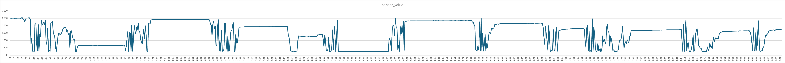
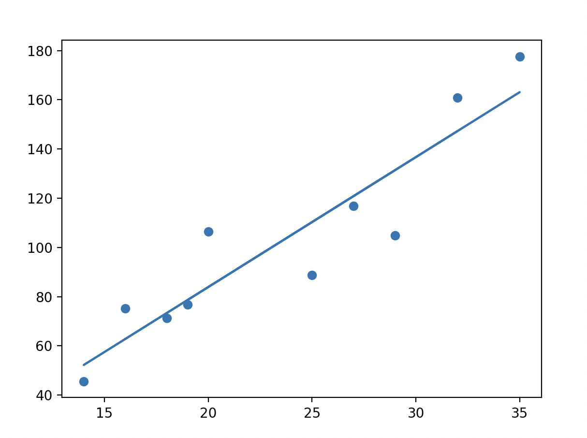

# ToiletPaperSUP
## 1日目 5/23
### やったこと
 - データをとるコードを作った
 - 実際にデータをとった(10試行分)
 

### 苦労したこと
#### トイレットペーパーを巻いている時のデータを抽出すること
- 直近5フレームの標準偏差を求め、100より大きければ動作中フラグ
- 静止時から3回連続で動作中ならば動き始めと確定
- 動作時から8回連続で動作中ならば動き終わりと確定
- 2つのイベントの感覚が15フレーム以内ならば前のイベントの始端から後のイベントの終端を繋ぎ、1つのイベントに(イベント間を大きくとっている為15フレーム以上感覚がないとありえん)
- 5フレームより小さい動作のイベントはノイズとして削除(0.5秒でトイペを取り終わることは今回はなかった)

### todo
- マイコン側
[ ] センサーからデータを取得する
[ ] 同様の方法でエッジ検出を行い、frame数を求める
[ ] フレーム数と今回求めたa, bから、予測cmを出す
[ ] フレーム数と予測cmをfirebaseに送信

- firebase側
[ ] データが送られたら、スマホ、webアプリに送信する。

- スマホ側, webアプリ側
[ ] firebaseから、予測cmを受け取る。
[ ] トイペ残量を表示
[ ] 無くなりそうアラートを作る
[ ] トイペ変えたよボタン作成

### 改善の余地があるところ
#### トイレットペーパー使用量を予測する際の数式 
a = 0.46019264998429477
b = 82.09617841063763
predicted_cm = a*framecount+b
##### 改善のやり方
- データやセンサーを増やし、さらに誤差を縮める。
現時点での誤差
   frame_count  used_cm  predicted_cm      error
0           62     88.8    110.628123  21.828123
1           36    111.4     98.663114 -12.736886
2           40    111.8    100.503884 -11.296116
3           23     88.8     92.680609   3.880609
4           24     89.2     93.140802   3.940802
5           30     90.0     95.901958   5.901958
6           23     90.4     92.680609   2.280609
7           62    135.0    110.628123 -24.371877
8           81    112.4    119.371783   6.971783
9           25     90.0     93.600995   3.600995

## 2日目 5/24
### やったこと
- データを取得するコードの変更
- データ取得/ 標準偏差導出 / 動作判定 / firebaseへ送信 を行うコードに変更

### 苦労したこと
#### firebaseとの接続方法がわからん
- わかった
- firebaseとの接続方法
    1. プロジェクトのurl/authenticationに入って、ログイン方法を開く
    2. メールとパスワード を押す
    3. ユーザから、メアドとパスワードを登録
    4. ソースコードの方で、FirebaseConfig config;と、FirebaseAuth auth;を定義する。あとapiキーや、データベースのurl、登録したメアドとパスワードを記録しとく
    5. 
    config.api_key = Api_key;
    config.database_url = Database_url;
    auth.user.email = USER_EMAIL;
    auth.user.password = USER_PASSWORD;

    Firebase.begin(&config, &auth);
    Firebase.reconnectWiFi(true);
    でデータベースとの接続開始
    6. Firebase.RTDB.pushInt(&gbdo, "/test", calcurate_cm);データ送る時はこれ。1つ目の変数が。2つ目の変数は送り先、3つ目は送るデータ。

### todo
- マイコン側
[x] センサーからデータを取得する
[x] 同様の方法でエッジ検出を行い、frame数を求める
[x] フレーム数と今回求めたa, bから、予測cmを出す
[x] フレーム数と予測cmをfirebaseに送信

- firebase側
[ ] データが送られたら、スマホ、webアプリに送信する。

- スマホ側, webアプリ側
[ ] firebaseから、予測cmを受け取る
[ ]Ncm使いました!みたいな表示をする
[ ] 本日、週、月のトイペ使用量を可視化する / 月毎、日毎なら簡単に実装できそう(2026-05*のデータだけ取って来る。みたいな感じで) 
[ ] トイペ残量を表示
[ ] 無くなりそうアラートを作る
[ ] トイペ変えたよボタン作成
[ ] 
 
- ex
[ ]長さ予測の式を改善する
[ ]データを集め直す

## 3日目 5/25
### やったこと
1. firebaseから、データを取得できるようにした。
2. firebaseから取得したデータを、月毎、日毎にグラフ表示できるようにした。
    - chart.js使った。
3. 直近3回分の利用履歴を表示できるようにした。
4. トイレットペーパーの残量表示を作った
5. トイレットペーパー買えたよボタンを作った。
6. トイレットペーパの残量やばいアラート作った

### 苦しんだ点
- データ可視化を、どのようにすればユーザが欲しい情報を与えることができるか悩んだ。
 - 毎時間分の使用量を集計してグラフ化、月の毎日の使用量を集計してグラフ化、年の毎月の使用量を集計してグラフ化？

- グラフが表示されない
 - forループのiにletが付いてないだけだった。

- グラフにデータが表示されなーーい
 - 

### todo
- マイコン側
[x] センサーからデータを取得する
[x] 同様の方法でエッジ検出を行い、frame数を求める
[x] フレーム数と今回求めたa, bから、予測cmを出す
[x] フレーム数と予測cmをfirebaseに送信

- webアプリ側
[x] firebaseから、予測cmを受け取る
[x] Ncm使いました!みたいな表示をする
[x] 本日、月のトイペ使用量を出力する
[x] 月毎のトイペ使用量を可視化する
[x] 日毎のトイペ使用量を可視化する
[ ] 時間ごとのトイペ使用量を可視化する
[x] トイペ残量を表示
[x] 無くなりそうアラートを作る
[x] トイペ変えたよボタン作成
 
- iOSアプリ側
[ ] firebaseから、予測cmを受け取る
[ ] Ncm使いました!みたいな表示をする
[ ] 本日、月のトイペ使用量を出力する
[ ] 月毎のトイペ使用量を可視化する
[ ] 日毎のトイペ使用量を可視化する
[ ] 時間ごとのトイペ使用量を可視化する
[ ] トイペ残量を表示
[ ] 無くなりそうアラートを作る
[ ] トイペ変えたよボタン作成

- ex
[ ]長さ予測の式を改善する
[x]データを集め直す
[ ]データを増やす
[ ]ユーザごとの情報を記録しとかないと、毎回初期化されるやんけ。→トイペ残量さえ保存しとけばいけそうかな？
[ ]webアプリのレイアウトを改良する

## 覚えときたいリスト
1. pio init --board esp32devでpioプロジェクト作れる

## 4日目 5/26
### やったこと
1. データを取り直した
    10件とった。しかし長さ予測の精度はそこまで大きく変わらなかった。
    データがどのような軌道に沿っているのか確認するために、グラフ表示した。
    
    結果的に、大体線形になっている。予測精度を上げるのに効果的なのは、まずはデータを増やすことかな、、、。それでも無理だったら、センサーを増やすことによって精度向上の可能性があると思う。
    変数を増やすのはそんなに効果的ではなさそう。
    理由：変数だけを増やす→最大値や最小値、平均・分散などが考えられる。
    　　　これらは、トイレットペーパーを取るときの動きに相関しているとは考えにくい。これら のような変数を増やすなら、加速度センサーをつけて紙を引っ張る速さを図って変数に入れた方が精度が良くなりそうだ。

2. 
